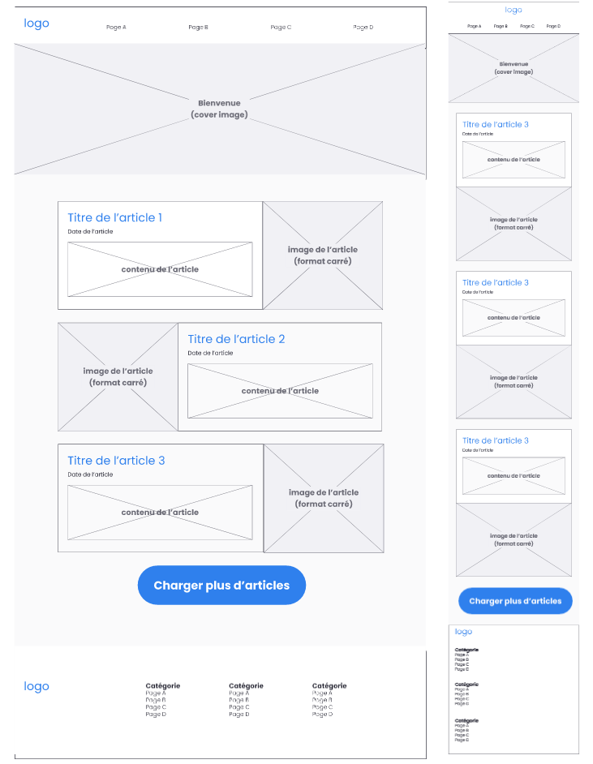

# PPE_Article

## Énoncé
Chacun d’entre vous dispose d’un sujet avec des questions et un thème de mise en pratique différent. Ne perdez pas de temps à chercher les correspondances avec vos camarades, tentez de répondre du mieux que vous pouvez aux consignes avec les supports et références de cours. 

- W3c 3 points
- Accessibilité 2 points 
- Réussite globale de la page 3 points 
- Esthétique 2 points
- Validité du css 2 points
- Comportement first mobile 3 points
- Javascript (ES6) 3 points
- Code sémantique 2 points

## Wareframe
